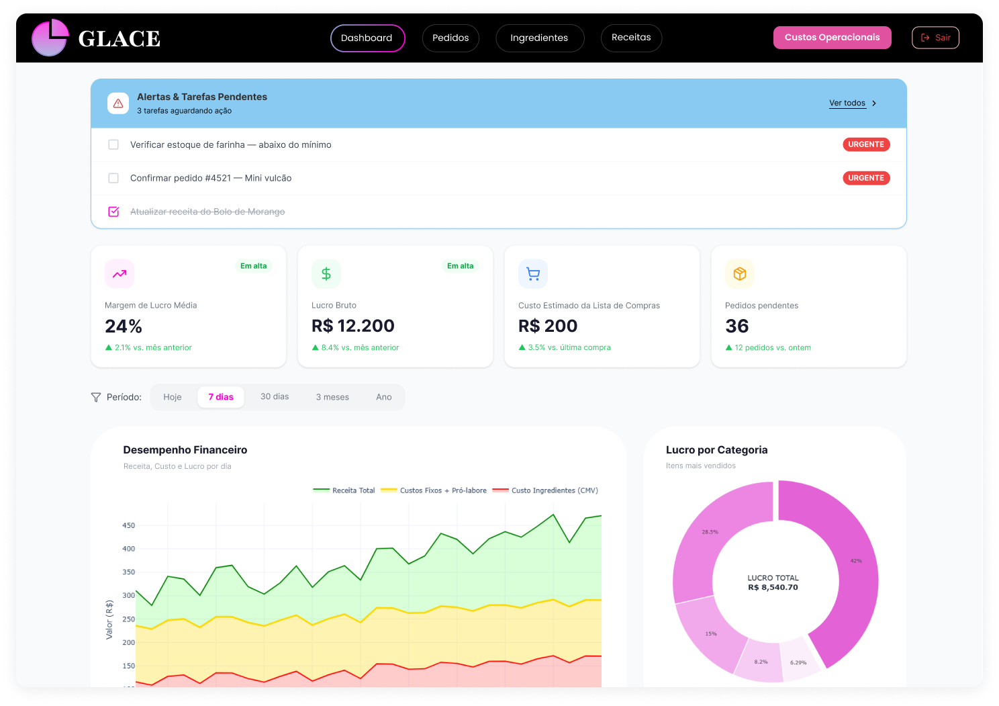
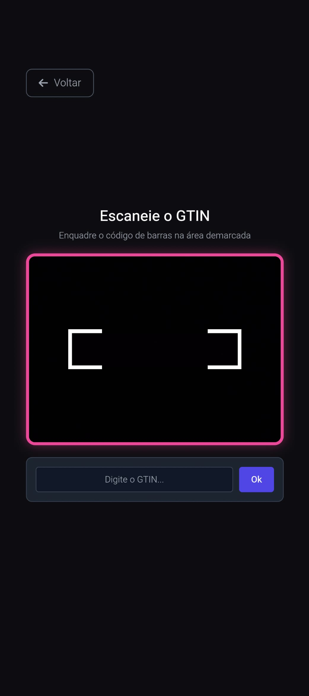
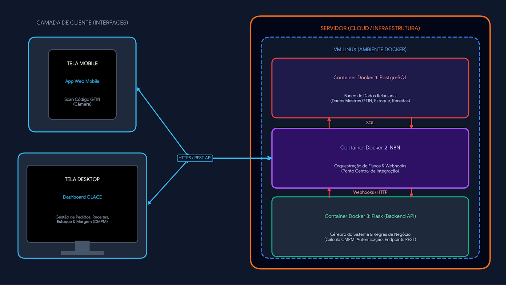

# GLACE — Plataforma de Gestão e Inteligência Financeira para Confeitarias


## 📌 Visão Geral

A plataforma GLACE é a solução de gestão operacional e inteligência financeira projetada especificamente para atender as necessidades de confeitarias. A plataforma transforma o caos das rotinas manuais, como anotações informais, planilhas espalhadas e precificação baseada em suposições, em um ecossistema digital automatizado. Entregando previsibilidade de caixa, clareza nos indicadores e aumento de eficiência operacional.

> 🤝 **Impacto Social e Validação Prática:** O projeto foi desenvolvido em parceria com a **ONG Vozes da Periferia**, atendendo às demandas reais de microempreendedores para criar uma ferramenta acessível, intuitiva e focada na emancipação financeira.

## 🏆 Reconhecimento: 3º Lugar no Prêmio Automação GS1 2026

O GLACE foi premiado em 3º Lugar, entre mais de 310 projetos, no Prêmio Automação 2026 da GS1 Brasil. 

O projeto destacou-se pelo impacto direto na transformação digital de microempreendimentos, validando a aplicação prática dos padrões globais GTIN (Global Trade Item Number) para eliminar a digitação manual de insumos, garantir a rastreabilidade da cadeia de suprimentos e democratizar o acesso à automação comercial no setor alimentício.

## ✨ Funcionalidades em Destaque

* 🎯 **Granularidade no Cálculo de Custos (CMPM):** O sistema calcula automaticamente o custo exato de cada ingrediente e receita, através do Custo Médio Ponderado Móvel. O sistema converte automaticamente embalagens comerciais (ex: pacote de 1kg) para a menor unidade de medida ($g$ ou $ml$), atualizando a margem das receitas em tempo real a cada variação de preço dos insumos.
* 📦 **Leitura de GTIN & Múltiplos Códigos por Ingrediente:** Agilidade no cadastro e registro de insumos, ao invés de digitar manualmente cada ingrediente, o usuário apenas escaneia o código GTIN via câmera do dispositivo. O sistema também suporta a associação de múltiplos códigos GTIN/EAN para um único ingrediente, permitindo que a confeiteira mude a marca ou o tamanho da embalagem sem desconfigurar a ficha técnica original.
* 🛒 **Lista de Compras Automática:** Mapeia o déficit do estoque comparando o saldo atual com a demanda das encomendas pendentes. O sistema gera a lista exata do que precisa ser comprado e calcula o aporte financeiro estimado antes da ida ao supermercado.
* 🔄 **Baixa Automática de Estoque:** Integração entre a gestão de pedidos e o estoque de insumos. Ao alterar o status de um pedido para `Entregue`, o sistema realiza a subtração proporcional dos ingredientes no banco de dados. Além de atualizar o Lucro Bruto real do empreendedor.
* ⚡ **Custos Operacionais:** Permite o registro simples de despesas fixas e variáveis (energia elétrica, água, gás de cozinha) que não podem ser atribuídas diretamente a uma única receita, garantindo precisão no fechamento financeiro mensal.

## 🖼️ Demonstração da Plataforma
<sub><em>💡 Clique em qualquer imagem para ampliar a visualização</em></sub>

|<a href="assets/dashboard.png"></a> | <a href="assets/gtin-scanner.png"></a> |
| :---: | :---: |
| **Painel de Indicadores da Plataforma** | **Scanner GTIN Mobile** | 

## 🏗️ Evolução da Arquitetura & Roadmap Técnico

O projeto foi estruturado em duas fases de maturação tecnológica, garantindo validação rápida em MVP e transição para uma infraestrutura robusta de nível de produção.

### Fase 1: MVP (Execução Local)
Ambiente de desenvolvimento e validação de funcionalidades.
* **Backend:** Python + Flask
* **Banco de Dados:** SQLite
* **Frontend:** HTML5, Tailwind CSS, JavaScript

### Fase 2: Arquitetura de Produção (Servidor Institucional)
A aplicação final do projeto contará com a utilização dos servidores da instituição, através de máquina virtual Linux com containerização Docker.


<a href="assets/arquitetura_sistema.png"></a>   

* **Backend & API:** Python com Flask para processamento de regras de negócio complexas.
* **Banco de Dados:** PostgreSQL para concorrência de acessos, alta disponibilidade e dados mestres.
* **Automação & Integrador:** n8n para orquestração de fluxos, integração via webhooks e notificações.
* **Infraestrutura:** Containers Docker rodando em VM Linux para isolamento e escalabilidade do ecossistema.
* **Frontend:** Interface responsiva construída em HTML5, Tailwind CSS e JavaScript para uso em dispositivos móveis e desktops.

## ⚡ Como Executar o Projeto

### Pré-requisitos
* Python 3.10 ou superior
* Git instalado

### Passo a Passo

1. **Clonar o repositório:**
   ```bash
   git clone https://github.com/IIIgorMoura/glace-analytics-platform
   cd glace-analytics-platform
   ```

2. **Criar e ativar o ambiente virtual:**   
   Se você utiliza Linux / macOS
   ```bash
   python3 -m venv venv
   source venv/bin/activate
   ```

   Se você utiliza Windows
   ```bash
   python -m venv venv
   venv\Scripts\activate
   ```

3. **Instalar as dependências do projeto:**
   ```bash
   pip install -r requirements.txt
   ```

4. **Executar a aplicação:**
   ```bash
   python run.py
   ```

5. **Acessar a plataforma:**
   Abra o navegador e acesse localmente [http://localhost:5000](http://localhost:5000).


